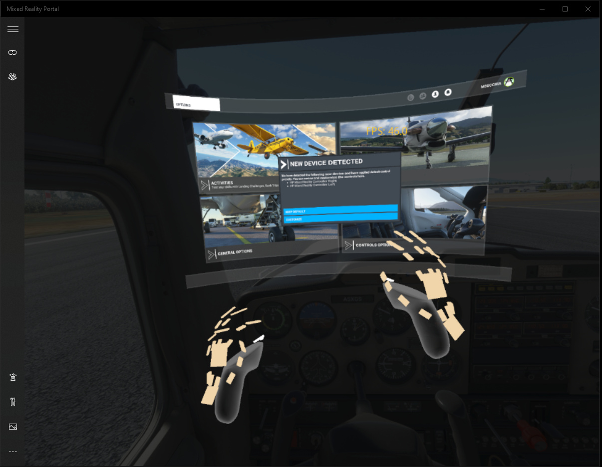

## Table of contents
{: .no_toc .text-delta }

1. TOC
{:toc}

---

## Adjust the OpenXR and in-game render scales

_This section to be written..._

## Disable in-game sharpening

Some users have reported better quality when disabling the in-game sharpening. This can be accomplished by manually editing the game's `UserCfg.opt` file.

**Prior to modifying the file, be sure to make a back-up copy**.

This file is located in a different folder depending on what store the game was purchased from.

For the Microsoft Store edition, the file is located at `C:\Users\your_login_name\AppData\Local\Packages\Microsoft.FlightSimulator_#############\LocalCache\UserCfg.opt`.

For the Steam edition, the file is located at `C:\Users\your_login_name\AppData\Roaming\Microsoft Flight Simulator\UserCfg.opt`.

Close Flight Simulator.

Open the file in a text editor (notepad will do if this is all you have available).

Locate the `{GraphicsVR` section.

In the `{PostProcess` subsection, set the value of `Sharpen` to 0.

```
{PostProcess
        Enabled 1
        EyeAdaptation 0
        ColorGrading 0
        Sharpen 0    <---
        Fringe 0
        LensDistortion 0
        Dirt 0
        LensFlare 0
        FilmGrain 0
        Vignette 0
        LensBlurMultiplier 1.000000
        FringeMultiplier 1.000000
    }
```

**Note:** If you are using the GeForce Experience automatic settings, this most likely cause your changes to the `UserCfg.opt` file to be erased in the future. You may want to consider disabling automatic settings.

## Disable GPU driver sharpening

_This section to be written..._

## Considerations for hand tracking

See the [Hand Tracking](hand-tracking) page for general details about hand tracking.

Flight Simulator 2020 can make use of hand tracking to control the various knobs, levers, buttons, etc in the aircraft's cockpit.

<br>
*Hand tracking in Microsoft Flight Similator 2020*

Upon enabling the hand tracking feature in the OpenXR Toolkit or entering VR, the game will report a New Device Detected through a pop-up screen.

<br>
*New Device Detected pop-up*

The basic configuration included in the OpenXR Toolkit is designed for use in VR controller "direct mode", which requires to switch to this mode with the B button on the VR controller. In the default configuration, touching the tip of your index fingers (from both hands) will simulate pressing the B button and must be done in order to enter the "direct mode".

The "pinch" gesture (bringing the tip of the thumb and index fingers together) can be used to simulate the VR controller trigger, which allows to interact with the controls in the cockpit.

The "squeeze" or "grab" gesture (bending the middle finger, ring finger and little finger in a trigger-like motion) will simulate  the VR controller grab button, which can be used to "switch the active hand".

Finally, tapping the left wrist with the right hand index finger is bound to the VR controller's menu button, which will bring up the menu.
