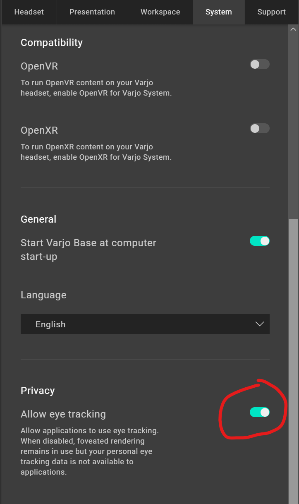
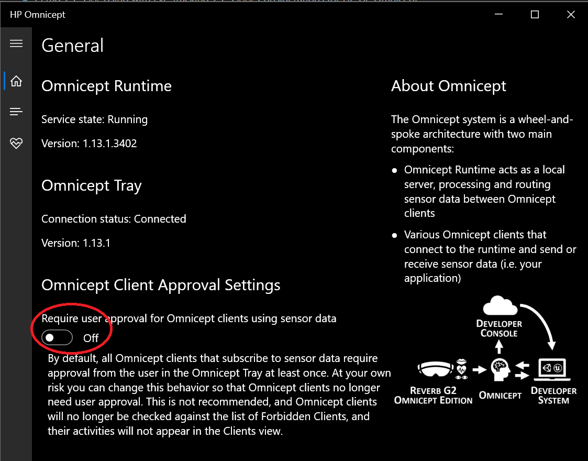
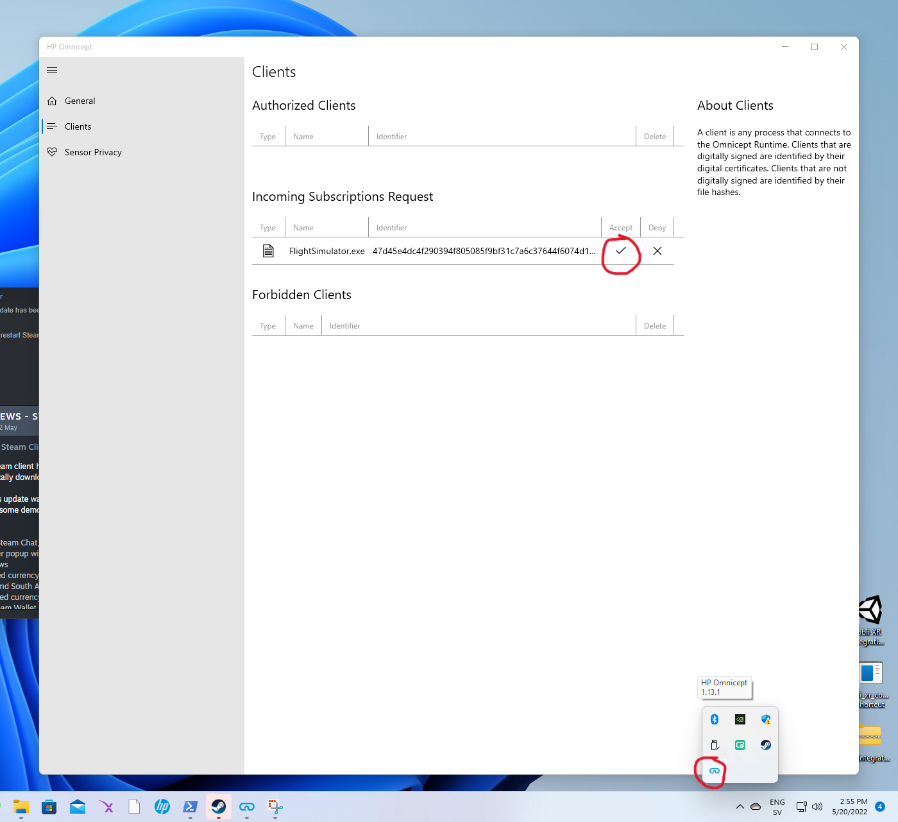
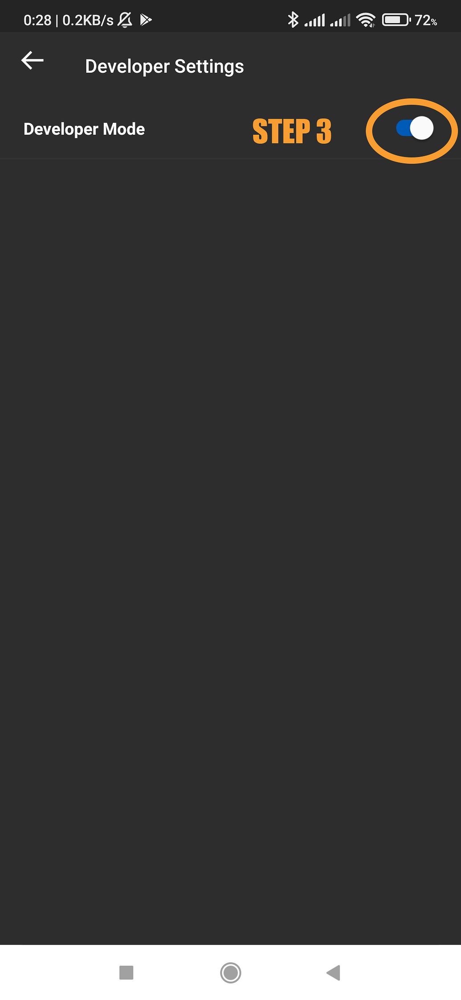
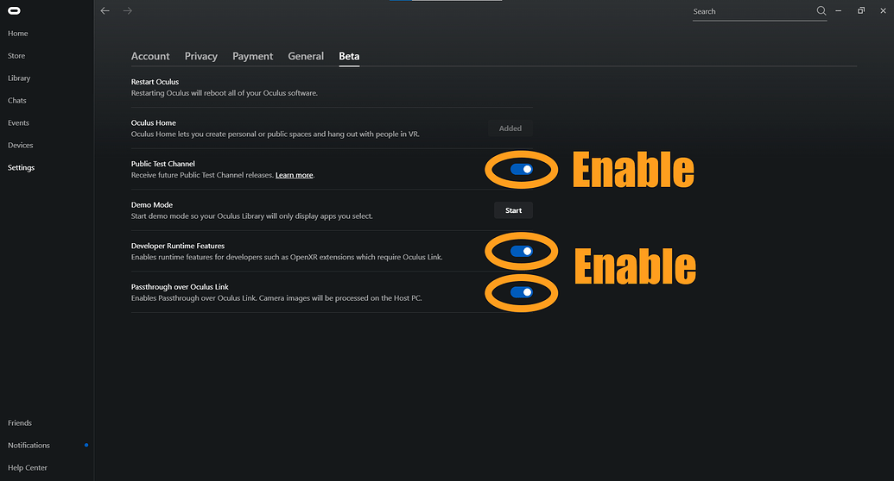

## Table of contents
{: .no_toc .text-delta }

1. TOC
{:toc}

---

## Supported headsets

The option to enable Eye Tracking will appear in the menu if and only if your headset and headset driver can support it.

See [Supported headsets / Eye tracking feature](index#eye-tracking-feature).

## Using Eye Tracking Foveated Rendering

The use of Eye Tracking (ET) in conjunction with [Foveated Rendering](fr) (FR) can greatly improve performance with minimal loss of visual quality.

**In addition to the requirements for your graphics card and headset, it must be possible for OpenXR Toolkit to distinguish when the application is rendering the left and right views. This is not possible for all applications, and therefore eye tracking might not be offered for all applications.** When not available, Fixed Foveated Rendering will still be offered as a fallback.

Below is a table of games tested with eye-tracked foveated rendering:

| Game | Note |
| --- | --- |
| Assetto Corsa Competizione | Requires [OpenComposite](opencomposite) |
| Fallout 4 VR | Requires OpenComposite |
| Hubris | |
| iRacing | Requires OpenXR mode |
| Microsoft Flight Simulator 2020 | |
| Pavlov VR (Beta) | |
| Praydog's UE4VR Injector | Mod is not yet released |
| The Elder Scrolls V: Skyrim VR | Requires OpenComposite |

Most Unreal Engine games using OpenXR directly (not OpenVR) should work, since Unreal Engine uses a rendering technique that allows left and right eye to be identified at rendering time.

### Considerations for Varjo

**Varjo supports eye tracking for PC applications when using Varjo as the OpenXR runtime. If you are using SteamVR as the OpenXR runtime, this runtime cannot support eye tracking for PC applications.**

You must toggle the _Allow eye tracking_ option from the _System_ tab of the Varjo Base software:

  
Click for details...

   
  <b>This option must be enabled for OpenXR Toolkit to access the eye tracking data for its own implementation of Foveated Rendering.</b>

### Considerations for HP G2 Omnicept

In order to use the eye tracker on your Omnicept device, you must first install the [HP Omnicept Runtime](https://developers.hp.com/omnicept/downloads/hp-omnicept-runtime).

Once installed, please run the HP Omnicept eye calibration application.

You must then allow applications to use the eye tracker. You can enable all applications by disabling the _Require user approval for Omnicept clients using sensor data_ option under the _Omnicept Client Approval Settings_ in the HP Omnicept software:

  
Click for details...

   
  <b>Toggling Off the Require user approval will allow all applications to use the eye tracker.</b>

    
You may otherwise selectively allow applications, one by one. You must first run the application once, enable eye tracking in the OpenXR Toolkit menu, then open the HP Omnicept software and allow the client, under the _Clients_ tab, in the _Incoming subscriptions request_ table:

  
Click for details...

   
  <b>You can Accept Incoming subscriptions requests to selecting allow an application, while forbidding others.</b>

### Considerations for Quest Pro

**Oculus Quest Pro only supports eye tracking for PC applications when using Oculus as the OpenXR runtime. If you are using SteamVR as the OpenXR runtime (for example, to use Virtual Desktop), this runtime cannot support eye tracking for PC applications.**

1. IMPORTANT: Create and log in with a [developer account](https://developer.oculus.com/sign-up/). You must be a registered developer for the Oculus runtime to expose the hand tracking features.

2. Ensure that your Oculus software is up-to-date (v49 or later).

3. Turn on Developer mode on the headset.

  
Click for details...

  
  

4. On your PC, open the _Oculus App_, and navigate to _Settings_ and the _Beta_ menu.

5. Enable _Developer Runtime Features_.

  
Click for details...

  

### Considerations for Pimax+Droolon

In order to use the Droolon eye tracking module on your Pimax device, you must first install the [aSeeVR SDK](https://drive.google.com/file/d/1ELDtOnMa-MkgchmWFf7w5an-iPOFtQL8/view?usp=sharing&_ga=2.110383681.599346747.1650530138-1983392096.1642581798).

Once installed, please run the aSeeVR runtime. In the system tray bar, right-click on the runtime, and make sure to enable _deviced_ -> _Pimax_.

When using Foveated Rendering in the OpenXR Toolkit, adjust the _Eye projection distance_ from the _Foveated rendering_ menu until you reach comfortable sensitivity.
