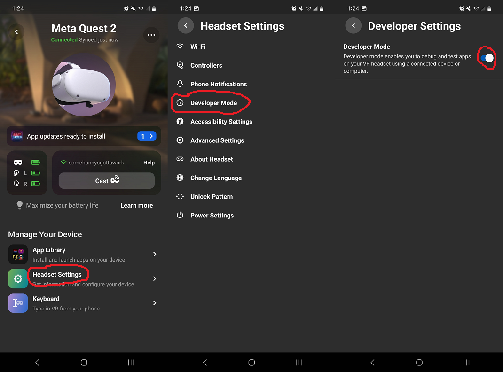
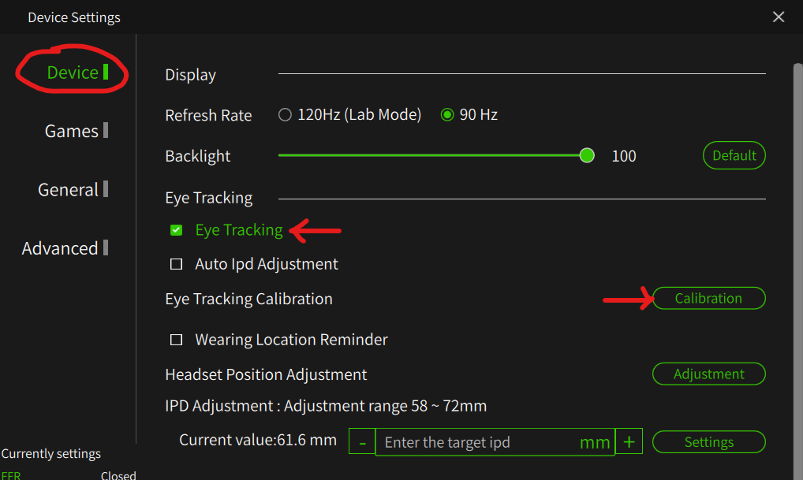

## Table of contents
{: .no_toc .text-delta }

1. TOC
{:toc}

---

## Supported headsets

The option to enable Eye Tracking will appear in the menu if and only if your headset and headset driver can support it.

See [Supported headsets / Eye tracking feature](index#eye-tracking-feature).

## Using Eye Tracking Foveated Rendering

The use of Eye Tracking (ET) in conjunction with [Foveated Rendering](fr) (FR) can greatly improve performance with minimal loss of visual quality.

**In addition to the requirements for your graphics card and headset, it must be possible for OpenXR Toolkit to distinguish when the application is rendering the left and right views. This is not possible for all applications, and therefore eye tracking might not be offered for all applications.** When not available, Fixed Foveated Rendering will still be offered as a fallback.

Below is a (non-exhaustive) table of games tested with eye-tracked foveated rendering:

| Game | Note |
| --- | --- |
| Assetto Corsa Competizione | Requires OpenComposite |
| Contractors | Must start the game in OpenXR mode (`-hmd=openxr` parameter) |
| Fallout 4 VR | Requires OpenComposite |
| Hubris | |
| iRacing | Must start the game in OpenXR mode |
| Microsoft Flight Simulator 2020 | |
| Pavlov VR (Beta) | |
| Praydog's UE4VR Injector | Mod is not yet released |
| The Elder Scrolls V: Skyrim VR | Requires OpenComposite |

Most Unreal Engine games using OpenXR directly (not OpenVR) should work, since Unreal Engine uses a rendering technique that allows left and right eye to be identified at rendering time.

For Digital Combat Simulator, check out [Quad-Views-Foveated](https://github.com/mbucchia/Quad-Views-Foveated/wiki) as an alternative to OpenXR Toolkit.

### Considerations for Quest Pro

#### Using Oculus OpenXR with Oculus Link

  
Click for details...

  
- Select Oculus as your OpenXR runtime. 
   
  

  
<b>- YOU MUST CREATE A <a href="https://developer.oculus.com/sign-up/">DEVELOPER ACCOUNT</a>.</b>

  
- Open the <i>Oculus</i> application on your PC, then under 'Settings' -> 'Beta' make sure both 'Developer Runtime Features' and 'Eye tracking over Oculus Link' are toggled on. 
  

  
- Open the <i>Meta Quest</i> app on your phone, then under 'Headset Settings' -> 'Developer Mode' make sure to 'Developer Mode' is toggled on. 
  

  
- Ensure that eye tracking is enabled on your Quest Pro, and you have performed calibration. These settings can be found under 'Settings' -> 'Movement tracking'. 
  

#### Using VirtualDesktopXR (VDXR) with Virtual Desktop

  
Click for details...

  
<b>- YOU MUST USE VIRTUAL DESKTOP 1.29.3 OR HIGHER</b>

  
- Select VDXR as your OpenXR runtime. 
  

  
- Ensure that eye tracking is enabled on your Quest Pro, and you have performed calibration. These settings can be found under 'Settings' -> 'Movement tracking'. 
  

  
- Open the <i>Virtual Desktop</i> app and navigate to the 'Streaming' settings. Enable 'Forward face/eye tracking to PC'. 
  

#### Using SteamVR OpenXR with Virtual Desktop

Follow the instructions to install [OpenXR-Eye-Trackers](https://github.com/mbucchia/OpenXR-Eye-Trackers/wiki/Meta-Quest-Pro#with-virtual-desktop).

### Considerations for Varjo

#### Using Varjo OpenXR

  
Click for details...

  
- Open the <i>Varjo Base</i> application on your PC then select Varjo as your OpenXR runtime. 
  

  
- In the 'System tab', under 'Privacy', toggle 'Allow eye tracking' to on. 
  

  
- Ensure that your eye tracker is calibrated. In the 'Headset' tab, under 'Foveated Rendering', make sure to select a method for using calibration.. 
  

#### Using SteamVR OpenXR

Follow the instructions to install [OpenXR-Eye-Trackers](https://github.com/mbucchia/OpenXR-Eye-Trackers/wiki/Varjo-Aero-VR%E2%80%903-XR%E2%80%903).

### Considerations for HP G2 Omnicept

#### Using OpenXR for Windows Mixed Reality

  
Click for details...

  
- Select Windows Mixed Reality as your OpenXR runtime. 
   
  

  
- Install the <a href="https://developers.hp.com/omnicept/downloads/hp-omnicept-runtime">HP Omnicept Runtime</a>.

  
- From the <i>HP Omnicept Tray</i>, open the 'Settings' page, and under 'General' -> 'Omnicept Client Approval Settings', toggle the 'Require user approval for Omnicept clients using sensor data' to Off. 
  

#### Using SteamVR OpenXR

Follow the instructions to install [OpenXR-Eye-Trackers](https://github.com/mbucchia/OpenXR-Eye-Trackers/wiki/HP-Reverb-G2-Omnicept).

### Considerations for Pimax Crystal

#### Using PimaxXR

  
Click for details...

  
- Open the <i>PimaxXR Control Center</i> application on your PC then select PimaxXR runtime. 
  

  
- Enable 'Allow use of the eye tracker'. 
  

  
  
- Open the <i>Pimax Play</i> application on your PC then navigate to 'Device Settings'. In the 'Device' tab, make sure that 'Eye Tracking' is enabled and use the 'Calibration' button to perform the calibration if needed. 
  

#### Using SteamVR OpenXR

Follow the instructions to install [OpenXR-Eye-Trackers](https://github.com/mbucchia/OpenXR-Eye-Trackers/wiki/Pimax-Crystal).

### Considerations for Pimax+Droolon

#### Using PimaxXR

  
Click for details...

  
- Open the <i>PimaxXR Control Center</i> application on your PC then select PimaxXR runtime. 
  

  
- Enable 'Allow use of the eye tracker'. 
  

  
Download and install the <a href="https://github.com/guppyexpress/Pimax-Eye-Tracking-Fix">7invensun runtime</a>, specifically the version modified by GuppyExpress. Follow the instructions to install and calibrate the eye tracker. _PimaxXR_ will automatically detect the Droolon Pi1 module once the 7invensun runtime is running.

### Considerations for Vive Pro Eye

Coming soon.
