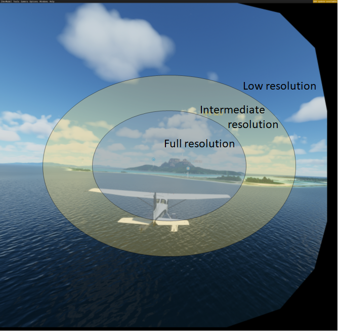
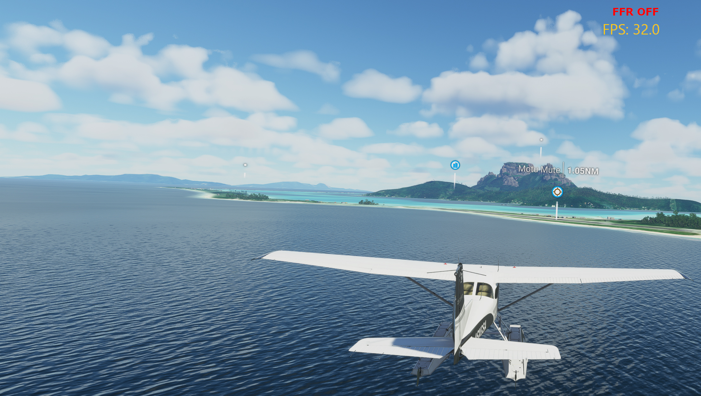
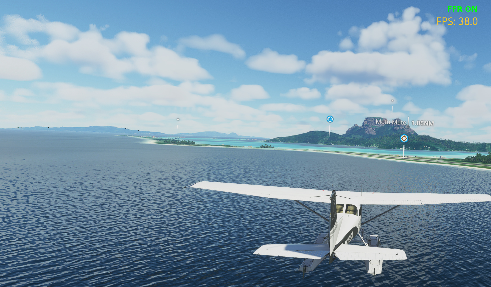
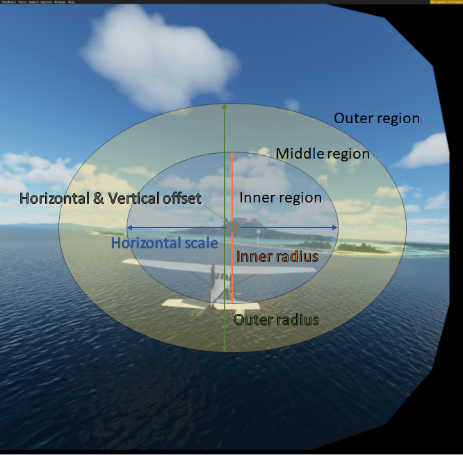
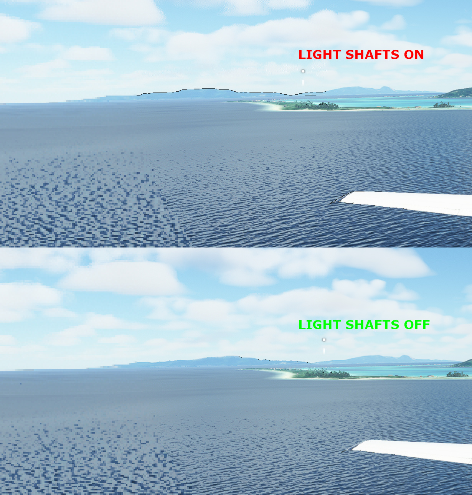
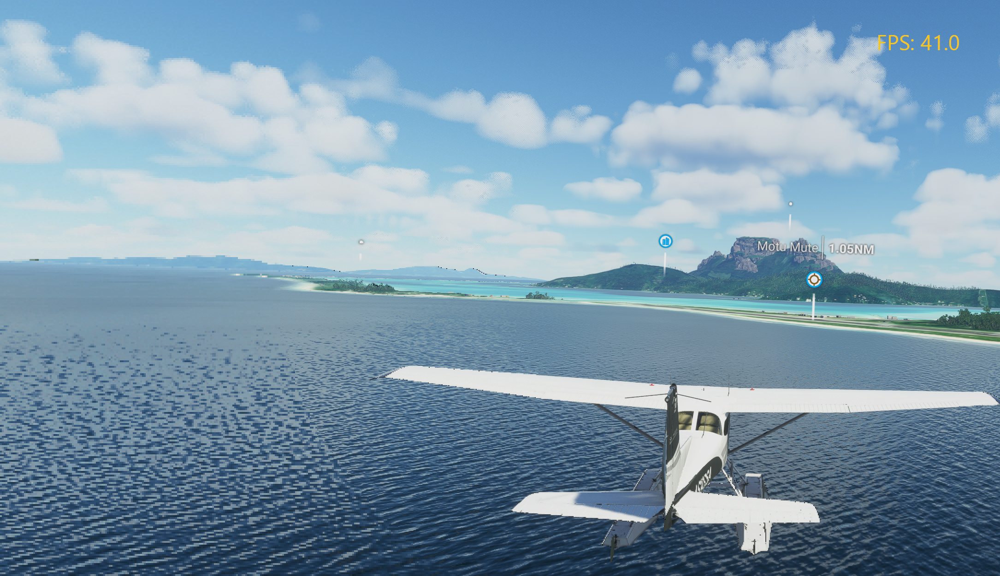
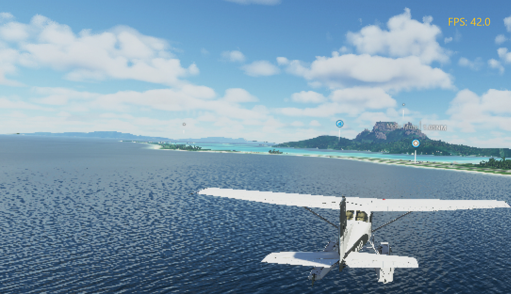
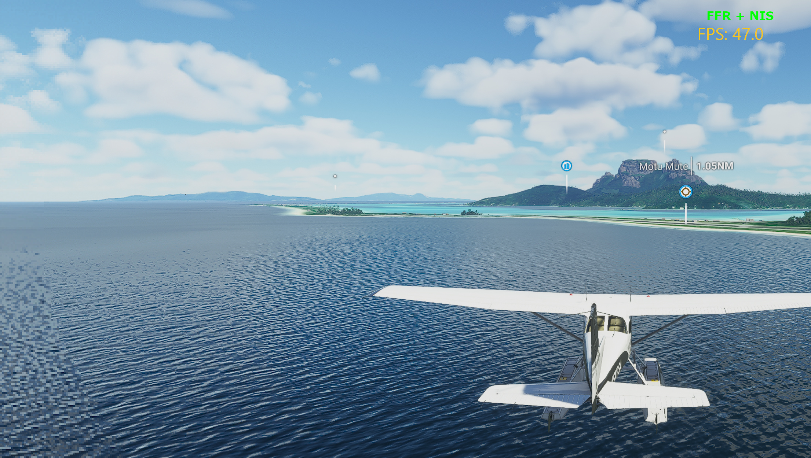

## Table of contents
{: .no_toc .text-delta }

1. TOC
{:toc}

---

## What is Fixed Foveated Rendering (FFR)?

Foveated Rendering is rendering technique that reduces the workload of the GPU by reducing the resolution of the image at the periphery of your vision.

 
*The image is divided into 3 regions, with the resolution decreasing the further we get from the center region.*

Fixed Foveated Rendering (or FFR) is a type of Foveated Rendering technique which assumes a fixed focal point, and does not use eye tracking. FFR is quite effective with VR headsets because 1) your eye gaze tends to always look at the center of the screen 2) the distortion created by the lenses of the headset alter your preception of the resolution near the edges of the screen.

**FFR is only effective at improving performance when you are being limited by your GPU.** FFR will not help if you are limited by your CPU.

 
 
*A comparison of FFR disabled (top) and FFR enabled (bottom)*

In the comparison above, you can see the noticeable difference in quality near the bottom left corner. However, when looking through the lenses of the headset, the difference is barely noticeable.

### Fixed Foveated Rendering in the OpenXR Toolkit

The option to enable FFR will appear in the menu if and only if your graphics card and graphics driver can support it. The following are supported:

+ NVIDIA GeForce GTX 1600 series and RTX series, both DX11 and DX12.
+ AMD RX 6000 series, with DX12 only.

There are two methods for configuring FFR in the OpenXR Toolkit.

#### Preset mode

In _Preset_ mode, we offer two parameters:

1. _Mode_, which can be set to Performance or Quality.
2. _Pattern_, which can be set to Wide, Balanced or Narrow.

The _Mode_ setting controls the resolution to apply for each of the 3 regions described earlier.

* Performance is equivalent to 1x - 1/4x - 1/16x (inner - middle - outer resolution).
* Quality is equivelent to 1x - 1/2x - 1/8x.

The _Pattern_ setting controls the size of the rings separating the regions. There are 2 rings (3 regions). The size is expressed in percent of the vertical resolution.

* Wide is equivelent to 55% - 80% (inner ring - outer ring).
* Balanced is equivalent to 50% - 60% .
* Narrow is equivalent to 30% - 55%.

Note that the rings are not of circular shape, and instead they are of elliptical shapes, with their aspect ratio "flattened" alongside the horizontal axis.

#### Custom mode

In _Custom_ mode, every aspect of the FFR feature can be tweaked.

 
*An exhaustive list of all settings for FFR.*

The resolution of the middle and outer regions (_Middle resolution_ and _Outer resolution_)  can be set to any of 1/2x, 1/4x, 1/8x and 1/16x. When the application is using DirectX 11, an additional option, _Cull_ is available to completely disable rendering for a region.

**Note:** to avoid creating poor configurations, the resolution of the inner region is fixed to 1x, and the other regions cannot be set to that resolution (1/2x and below).

The size of the rings separating each region (_Inner ring size_ and _Outer ring size)_ can be set to any ratio. There are 2 rings (3 regions). The size is expressed in percent of the vertical resolution.

When enabled in the _Menu_ tab, Expert settings are also unlocked, allowing you to further customize the size, aspect and positioning of the regions.

The _Horizontal offset_ and _Vertical offset_ settings allow you to move the center of the regions. Note that the _Horizontal offset_ is expressed relative to the left eye (meaning a negative value moves the center towards the left), however the offset is applied in the opposite direction to the right eye (a negative value moves the center towards the right).

The _Horizontal scale_ value lets you control the scale of the horizontal radius (also known as the semi-major axis) based on the vertical radius (also known as the semi-minor axis). A value of 100% means that the rings are circles. A value larger than 100% will result in flattened, oval-shaped rings.

Finally, the _Left/Right_ _Bias_ value lets you lower the resolution of all the regions at once, either for the left or the right eye only at a time. Each setting value changes the regions resolutions one notch down (for example +1 changes 1/2 to 1/4 and +2 changes 1/2 to 1/8). This setting can adjust the bias up to _+4_ on either eye. Select _none_ to remove any bias.

### Improving the quality of Fixed Foveated Rendering

Certain graphics settings in the application may create additional artifacts. There are a few ways to deal this this situation:

1. Increase the radius values or enable Expert settings and increase the _Horizontal scale_ until the degradations are no longer visible (which may lead to a lower gain in frame rate).

2. Experiment with different resolutions in the _Custom_ settings, and try both _Prefer resolution_ settings in conjunction with the 1/2x and 1/8x resolutions.

3. Find and disable the graphic settings causing the issue (which may lead to a lower graphics fidelity).

In the example below, we see how the the "Light shafts" feature in Microsoft Flight Simulator 2020 creates undesirable black lines near the horizon line. However, when the feature is disabled, the artifacts are nearly completely gone.

 
*A demonstration of light shafts on (top) and off (bottom) and the impact on visual quality with FFR.*

This issue can also be resolved by using the 1/2x and 1/8x resolutions exclusively, and ensure that the _Prefer resolution_ setting is set to Vertical.

Another way to reduce or conceal some of the visual artifacts is to use the sharpening features of the NIS or FSR upscalers (see [Upscaling](upscaling)).

Lowering the rendering resolution before the FFR processing happens (ie: the render scale setting within the application) has also shown to create visible artifacts. For this reason, it is also preferred to use the upscaling feature of the OpenXR Toolkit rather than any in-app upscaling.

### Balancing performance and finding the limit of the gain

Configuring a narrower inner and middle regions may improve performance further, however the loss in quality will become more and more noticeable.

 
*FFR with a Narrow pattern.*

In the example above, we show how the Narrow pattern creates a large region at low resolution near the edges of the screen. This region is noticeable even with the distortion created by the lense inside the headset.

It is important to understand that the [Variable Rate Shading (VRS)](glossary.html#vrs) technology employed for FFR is only effective at reducing or eliminating certain bottlenecks of the graphics pipeline.

 
*FFR set to the lowest resolution for the whole screen.*

In the example above, we show how setting the lowest resolution for all 3 regions produces a very low quality image, while not raising the performance over the aggressive settings shown earlier. This is because the limiting factor for performance is no longer at the stage of the graphics pipeline where FFR can help.

**In other words, setting the radius for the inner and outer regions to a lower value does not always result in a higher performance gain.**

### Combining with the upscaling feature

Fixed Foveated Rendering works very well with the [Upscaling](upscaling) feature of the OpenXR Toolkit, and can provide even more boost in performance.

 
*FFR combined with the NIS upscaler in Microsoft Flight Simulator 2020, providing a total boost of 15 FPS.*
