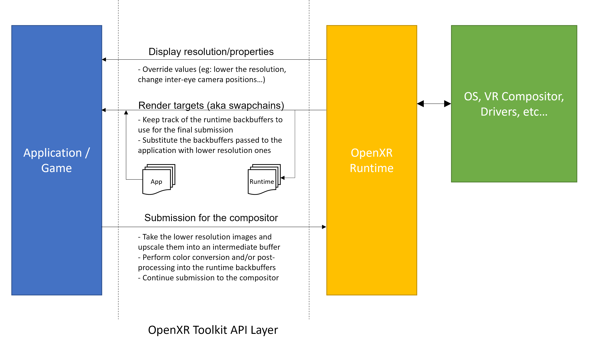
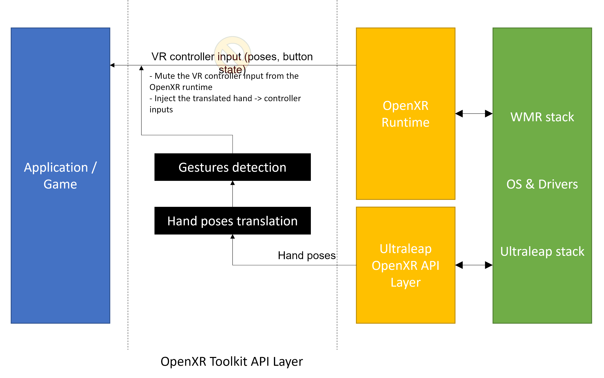

## Table of contents
{: .no_toc .text-delta }

1. TOC
{:toc}

---

## OpenXR API layers

OpenXR is an Application Programming Interface (API) defining a set of data structures and functions to present the many features of a VR platform to an application or game. This includes retrieving the capabilities of the VR headset, the properties needed to perform 3D stereoscopic rendering from the user's head position, how to send the rendered scene to the headset, how to retrieve VR controller input, and more...

The OpenXR runtime is the software that an application or game interacts with and that must behave in compliance with the [OpenXR API specification](https://www.khronos.org/registry/OpenXR/specs/1.0/html/xrspec.html) (meaning all vendors supporting their VR platform must implement this common behavior). The OpenXR runtime in turn interfaces with the operating system VR compositor and low-level device drivers, which are typically designed for each brand or model of VR platform with their own unique behaviors and special features.

The OpenXR specification defines support for "API Layers", which allows developers to insert custom code between the application and the OpenXR runtime. For example, an application must call a specific API to submit its rendered image to the VR headset. An API layer (software) can be inserted to intercept this API call, perform its own processing on the rendered image, before forwarding the call to the OpenXR runtime.

**The OpenXR Toolkit is an OpenXR API layer**.

## Inserting frame processing (for example an upscaler)

In order to perform NIS upscaling on the scene rendered by an application or game, we can use an API layer to intercept the necessay calls.

 
*Simplified API layer frame processing diagram*

- We intercept the call advertising the resolution that the application must target. We "lie" to the application and indicate a lower resolution instead.
- We intercept the rendering targets (buffers, textures, swapchain, people use different names) that the OpenXR runtime gives to the application. We replace them with lower resolution buffers (as expected since we "pretended" to use a lower resolution above). We keep the buffers with the "real" resolution for later use.
- We intercept when the application call the OpenXR runtime to submit the rendered scene. We then perform the upscaling process into those "real" resolution buffers that we savec earlier, and these are the buffers that get submitted to the OpenXR runtime for display in the headset.
- During the step above, we can also do other things like rendering the text for the menu or the FPS overlay, or even render 3D hands (like we do when hand tracking is working).

## Simulating inputs (for the Hand-to-Controller feature)

The VR controller inputs are specified in the OpenXR API as a specific set of data structures and operations. These are able to represent and report the position and orientation of the controller in 3D space, along with the state of the triggers and buttons.

The hand tracking inputs are specified in the OpenXR API using a different set of data structures and operations, something called the `XR_EXT_hand_tracking` extension. This is because representing hand interactions is more complex than for a VR controller. See more details [here](hand-tracking#prerequisites).

These two APIs are not compatible. An application that is written to support VR controllers will not automatically support hand tracking and vice-versa.

Certain OpenXR runtimes offer VR controller to hand tracking API translation: for example the Windows Mixed Reality runtime does (and this is why if you look at the list of OpenXR extension in the _Developer Tools for Windows Mixed Reality_, you will spot the `XR_EXT_hand_tracking` extension). This means that even though the platform does not support hand tracking, applications designed with hand tracking support only will still work with the VR controllers. There are limitations, as the VR controller cannot simulate all 26 hand joints.

Certain vendors, such as Ultraleap, have developed their own [OpenXR API layer](https://github.com/ultraleap/OpenXRHandTracking) to offer the `XR_EXT_hand_tracking` extension for hand tracking with their products. **However, this support only works with application that are designed with hand tracking support**. For applications that only support the VR controller input APIs, the Ultraleap support will not help.

Enters the OpenXR Toolkit. The toolkit's API layer sits between the application **and the Ultraleap API layer**, performing translation of the `XR_EXT_hand_tracking` APIs into VR controller inputs. Technically, the OpenXR runtime is not involved in this process.

 
*Simplified API layer input simulation diagram*

- We suppress the VR controller inputs that are normally reported by the OpenXR runtime. We are going to replace these inputs with our own.
- We initialize the resources needed for the `XR_EXT_hand_tracking` extension that is provided through the Ultraleap API layer.
- For each frame, when the application queries the VR controller inputs, we query the Ultraleap API layer's hand tracking inputs, and we translate them into the data structures needed for VR controller input.
- We perform simple gestures detection to simulate controllers buttons.
