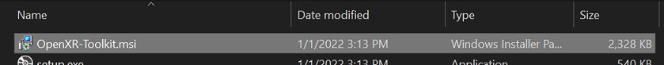
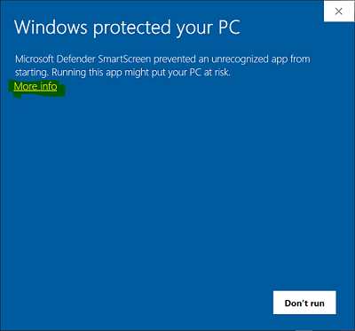
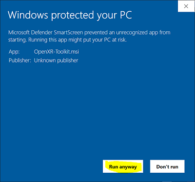
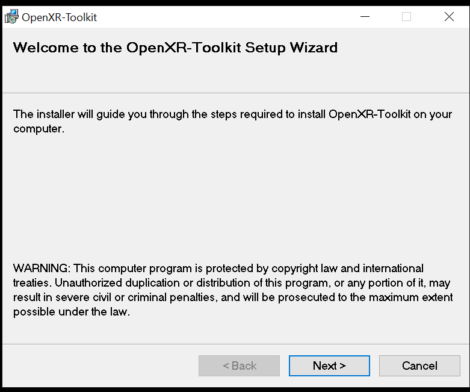
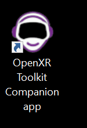
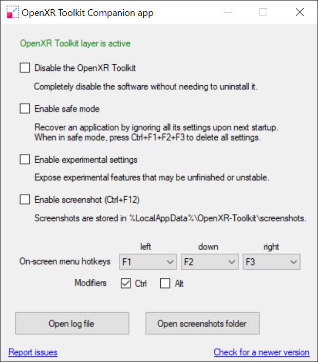
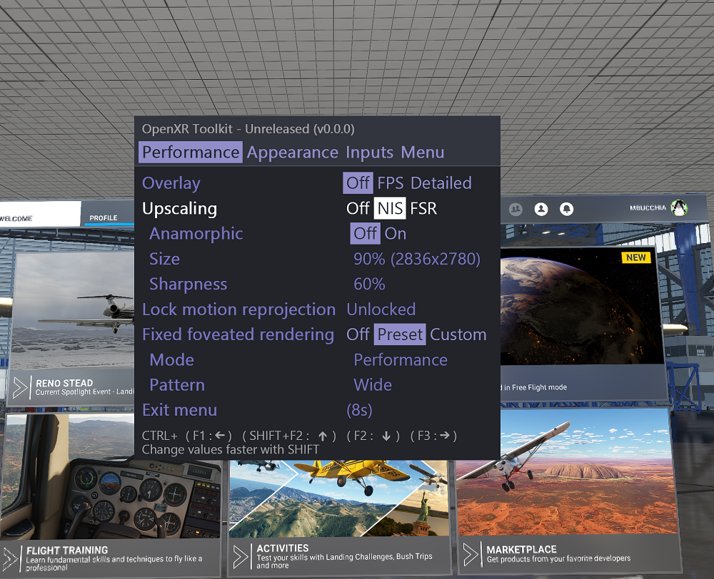
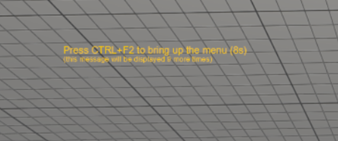
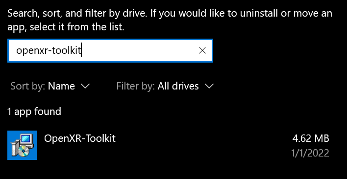

# OpenXR Toolkit

This software provides a collection of useful features to customize and improve existing OpenXR applications, including render upscaling and sharpening, hand tracking to controller input simulation (on supported devices only) and other game-enhancing tweaks.

For more details on how it works, see the [How does it work?](how-does-it-work).

DISCLAIMER: This software is distributed as-is, without any warranties or conditions of any kind. Use at your own risks.

# Setup

## Downloads

Current version: **Beta #3 (1.0.5)**

[Download the latest](https://github.com/mbucchia/OpenXR-Toolkit/releases/download/1.0.5/OpenXR-Toolkit-1.0.5.msi){: .btn .btn-blue }

...or expore [all versions](https://github.com/mbucchia/OpenXR-Toolkit/releases).

## Requirements

This software may be used with any brand of VR headset as long as the target application uses any GPU compatible with DirectX 11 and above, and is developed using OpenXR.

The following OpenXR ToolKit features have additional restrictions:

+ Fixed Foveated Rendering and Foveated Rendering are only supported with the following GPUs:
  + NVIDIA GeForce GTX 1600 series and RTX series, both DX11 and DX12.
  + AMD RX 6000 series, with DX12 applications only.

+ Foveated Rendering with eye tracking is only supported with the following headsets:
  + Varjo-brand devices.
  + HP G2 Omnicept.
  + Pimax-brand devices with Droolon eye tracking module. 

## Limitations

+ This software was only extensively tested with Microsoft Flight Simulator 2020.
  + It is also expected this software should work with most Steam games if they are using OpenXR (instead of Steam's OpenVR).
  + It can be used with certain games through [OpenComposite-ACC](oc-acc).
+ If using with an HTC Vive Pro 2 or Cosmos, please select SteamVR as your OpenXR runtime.
+ Fixed Foveated Rendering in Microsoft Flight Simulator only works when TAA is enabled with a render scale of at least 51%.
+ Fixed Foveated Rendering in Microsoft Flight Simulator is incorrectly applied in the main menu, resulting in blurry menu windows.
+ The menu does not display correctly on Pimax headsets.
+ The OpenXR Toolkit is incompatble with ReShade.
+ See the [open bugs](https://github.com/mbucchia/OpenXR-Toolkit/issues?q=is%3Aopen+is%3Aissue+label%3Abug).

For future plans, see the [Roadmap](roadmap).

> ⚠️ **Warning:** if you are using the previous NIS Scaler or Hand-To-Controller layer before, please uninstall them now.

## Installation

Video tutorial by [PIE IN THE SKY TOURS](https://www.youtube.com/c/pieintheskytours):

<iframe width="560" height="315" src="https://www.youtube.com/embed/3CW8x9TBeQ0" title="YouTube video player" frameborder="0" allow="accelerometer; autoplay; clipboard-write; encrypted-media; gyroscope; picture-in-picture" allowfullscreen></iframe>

### 1. Run the `OpenXR-Toolkit.msi` program.

> 📝 **Note:** You may be warned that Windows protected your PC because this software is not trusted. The application is built on a GitHub server hosted in the Microsoft cloud, which greatly limits the risk of contamination from viruses and malware. Additionally, we have digitally signed the software through a reputable organization (Comodo) which helps with guaranteeing that is has not been altered by any third party.

  
Proceed through the "Windows protected your PC" warning...

  
Select <i>More info</i> then <i>Run anyway</i>.

  
  

### 2. Follow the instructions to complete the installation procedure.

### 3. Launch the _OpenXR Toolkit Companion app_ to confirm that the software is active.

  
You can use the shorcut found on the desktop or in the Start menu...

  
  

The _OpenXR Toolkit Companion app_ may be used sporadically to enable or disable advanced features or perform recovery (see further below). The application displays a green or red status indicating whether the software OpenXR component is active:

> 💡 **Tip:** You don't need to keep the companion app running in order to use the software: the actual settings for the toolkit are available from within your OpenXR application and display directly in the headset! (see below). 

# Basic usage

Once installed, please run the desired OpenXR application and use `CTRL+F2` to open the configuration menu:

In order to navigate the menu, select options and change values:

- Use `CTRL+F2` to move to the next option (next line) in the menu.
- Use `CTRL+F1` to move selection to the left / decrease the option value.
- Use `CTRL+F3` to move selection to the right / increase the option value.
- Hold both `SHIFT` and `CTRL` together to change values fasters.

> 💡 **Tip:** Use the _OpenXR Toolkit Companion app_ to change the default shortcut keys.

> 💡 **Tip:** When starting an application for the first time, use the configuration menu to adjust the _Menu eye offset_ until the text appears correctly (eg: no "double vision").

> 📝 **Note:** The first few times you're using the OpenXR Toolkit with a new application, a convenient reminder message will appear in the headset and confirms whether the software is operating properly.

  
On-screen indicator...

  

  
## Available options

See [Features](features) for more details.

**Performance** tab:
- **Overlay**: Enables the FPS display or advanced timings display in the top-right corner of the view. _Please note that the overlay may reduce performance_. A fourth option - "_Developer_" - is available in experimental mode and may be used for troubleshooting with the developer.
- **Upscaling**: Enables the use of an upscaler such as NIS or FSR to perform rendering at a lower resolution, and upscale and/or sharpen the image. Requires to restart the VR session.
  - **Anamorphic**: When _Disabled_, the _Size_ scales both the width and the height propotionally. When _Enabled_, both sizes can be adjusted independently.
  - **Size**: The upscaling factor (ie: the percentage of magnification of the rendering resolution). The resolution displayed next to the percentage is the effective resolution that the application sees. Requires to restart the VR session.
  - **Width/Height**: This displays the actual in-game render width and height, that is the actual number of pixels the game is rendering per eye.
  - **Sharpness**: The sharpness factor. Has a different scale/effect between NIS and FSR.
  - **Mip-map bias** (_Expert_ setting): This settings changes how the game is rendering some of the textures in order to reveal a little bit more details when used with FSR/NIS upscalers.
- **(Fixed) Foveated rendering** (on supported GPUs only): These settings adjust the [VRS](glossary#vrs) parameters in order to balance out peripheral visual details with rendering performance.
  - **Eye tracking** (on supported headsets only): Enable the use of eye tracking to control the position of the center of the foveated region.
  - **Eye projection distance** (only with Pimax headsets): Calibrate the sensitivy of eye gaze movements.

  [_Preset_ _mode_ ](fr#preset-mode)
  - **Mode**: Whether to prefer performance over quality.
  - **Pattern**: The size of the foveated regions.
  
  [_Custom_ _mode_](fr#custom-mode)
  - **Inner resolution** (_Expert_ _setting_): The resolution inside the inner ring of foveation. Should be left at full resolution (1x).
  - **Inner ring size**: The size of the inner ring of foveation, in percent of the height of the image.
  - **Middle resolution**: The resolution inside the middle ring of foveation.
  - **Outer ring size**: The size of the outer ring of foveation, in percent of the height of the image.
  - **Outer resolution**: The resolution inside the outer ring of foveation.
  - **Horizontal scale** (_Expert_ _setting_): The rings for foveation can be configured as ellipses. This setting controls the scale of the horizontal radius (or semi-major axis) based on the vertical radius (or semi-minor axis). A value of 100% means that the rings are circles. A value larger than 100% will result in flattened, oval-shaped rings.
  - **Horizontal offset** (_Expert_ _setting_): Add a horizontal offset to the center of the foveation rings. The offset is expressed relative to the left eye, and its opposite value will be applied to the right eye.
  - **Vertical offset** (_Expert_ _setting_): Add a vertical offset to the center of the foveation rings.
  - **Left/Right Bias** (_Expert_ _setting_): Lower the resolution of all the regions at once, either for the left or the right eye only at a time.

**Appearance** tab:
- **Post-processing**: TODO
- **Sun Glasses**: TODO
- **Contrast**: Adjust the contrast of the image.
- **Brightness**: Adjust the brightness of the image.
- **Exposure**: TODO
- **Saturation**: TODO
- **Vibrance**: TODO
- **Highlights**: TODO
- **Shadows**: TODO
- **Red**, **Green**, **Blue** (_Expert_ _setting_): TODO
- **World scale**: The Inter-Camera Distance override, which can be used to alter the world scale.

**Inputs** tab:
- **Shaking reduction**, formerly **Prediction dampening** (only when supported by the system): The prediction override, which can be use to dampen the prediction for head, controllers, and hand movements.
- **Controller emulation** (only when hand tracking is supported by the system): Enable the use of hand tracking in place of the VR controller. Requires a compatible device, such a Leap Motion controller or an Oculus Quest 2 headset. Either or both hands can be enabled at a time. Requires to restart the VR session when toggling on or off. 
  - **Hands skeleton**: Whether the hands are displayed and what color tone to use.
  - **Controller timeout**: The amount of time after losing track of the hands before simulator shutdown of the simulated VR controller.

**System** tab:
- **Override resolution**: Enable overriding the OpenXR target resolution (same as what the "custom render scale" in OpenXR does).
  - **Display resolution (per-eye)**: The resolution to use for each eye.
- **Motion reprojection** (only with Windows Mixed Reality): Enable overriding the Motion Reprojection mode. _Default_ means to use the system settings (from the _OpenXR Tools for Windows Mixed Reality_).
  - **Lock motion reprojection** (only with Windows Mixed Reality, when _Motion Reprojection_ if forced to _On_): Disable automatic motion reprojection adjustment, and lock the frame rate to the desired fraction of the refresh rate.
- **Field of view**: Adjust the pixel density per degree. A smaller field of view is covering a smaller region of the view but with the same amount of pixels, effectively increasing the perceived resolution.
  - **Adjustement** (in _Simple_ mode): Override all 4 angles (up/down/left/right) equally.
  - **Up** (in _Advanced_ mode): Override the "up" angle for both eyes.
  - **Down** (in _Advanced_ mode): Override the "down" angle for both eyes.
  - **Left/Left** (in _Advanced_ mode): Override the "left" angle for the left eye.
  - **Left/Right** (in _Advanced_ mode): Override the "right" angle for the left eye.
  - **Right/Left** (in _Advanced_ mode): Override the "left" angle for the right eye.
  - **Right/Right** (in _Advanced_ mode): Override the "right" angle for the right eye.
- **Pimax WFOV Hack** (Flight Simulator 2020 only, with Pimax headsets): Enable the Wide FOV hack to reduce game "over-culling".

**Menu** tab:
- **Show expert settings**: Show all settings. *This can be pretty overwhelming for certain features*.
- **Font size**: The size of the text for the menu.
- **Menu timeout**: The duration after which the menu automatically disappears when there is no input.
- **Menu eye offset**: Adjust rendering of the menu until the text appears clear.

# Recovery

See [Troubleshooting](troubleshooting) for more details.

If changing some settings render the application unusable, use Ctrl+F1+F2+F3 to hard reset all settings.

**Note: if the key combinations were changed from the _OpenXR Toolkit Companion app_, please use the newly assigned keys**.

 If an application can no longer start, use the _OpenXR Toolkit Companion app_ (found on the desktop or Start menu) and select the Safe mode before starting the application, then use Ctrl+F1+F2+F3 (regardless of custom key combinations) to hard reset all settings.

# Removal

The software can be removed from Windows' _Add or remove programs_ menu.

In the list of applications, select _OpenXR-Toolkit_, then click _Uninstall_.

