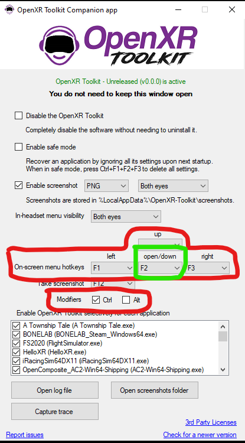
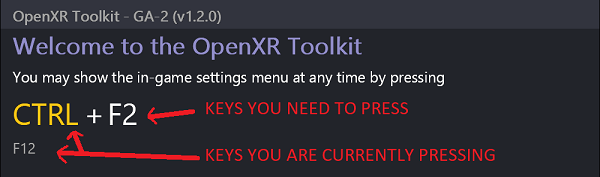
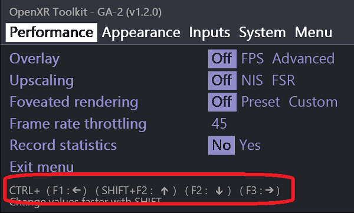

# OpenXR Toolkit

This software provides a collection of useful features to customize and improve existing OpenXR applications, including render upscaling and sharpening, foveated rendering, image post-processing, hand tracking to controller input simulation (on supported devices only) and other game-enhancing tweaks.

DISCLAIMER: This software is distributed as-is, without any warranties or conditions of any kind. Use at your own risks.

## Table of contents
{: .no_toc .text-delta }

1. TOC
{:toc}

---

# Setup

## Downloads

Current version: **1.3.1**

[Download the latest](https://github.com/mbucchia/OpenXR-Toolkit/releases/download/1.3.1/OpenXR-Toolkit-1.3.1.msi){: .btn .btn-blue }

...or expore [all versions](https://github.com/mbucchia/OpenXR-Toolkit/releases).

## Requirements

### Supported headsets

OpenXR Toolkit is compatible with any headset supporting OpenXR on PC. Lately, marketing tends to advertise OpenXR support for certain devices without mentioning whether it is applicable to standalone mode (eg: Android apps) or PC. Fortunately, the majority of headsets can support OpenXR via SteamVR as a fallback, and leverage OpenXR Toolkit that way.

For headsets that do not require the use of OpenXR via SteamVR, please note that using OpenXR via SteamVR is still an option, if you prefer to use SteamVR. OpenXR Toolkit will work both with the native OpenXR runtime and OpenXR via SteamVR.

Please note that if you are interested in using OpenXR Toolkit with OpenVR applications through [OpenComposite](opencomposite), [that table](opencomposite#headset-compatibility) will tell you a more accurate story than the table below.

| Headset brand | Supports OpenXR Toolkit | Requires OpenXR via SteamVR |
| --- | --- | --- |
| Windows Mixed Reality (HP Reverb, Samsung Odyssey...) | Yes | No |
| Oculus (Rift, Quest, Quest 2, Quest Pro...) | Yes | No |
| Oculus (via Virtual Desktop) | Yes | Yes [1] |
| Varjo (Aero, VR-3...) | Yes | No |
| Pimax (5K, 8K...) | Yes | No [2] |
| HTC Tier 1 (Vive original, Vive Pro) | Yes | Yes |
| HTC Tier 2 (Vive Cosmos, Vive Focus) | Yes | No |
| Valve Index | Yes | Yes |
| Pico (Neo 3, Neo 4) | Yes | Yes [1] |

[1] Using Oculus via Virtual Desktop or Pico via Virtual Desktop or Streaming Assistant requires to use OpenXR via SteamVR.

[2] Pimax officially only supports OpenXR via SteamVR, however you may consider using [PimaxXR](https://github.com/mbucchia/Pimax-OpenXR/wiki) to remove the use of SteamVR.

#### Eye tracking feature

| Headset brand | Supports eye tracking in OpenXR Toolkit? |
| --- | --- |
| HP Reverb G2 Omnicept | Yes |
| Oculus Quest Pro | Yes [2] |
| Varjo (all models) | Yes |
| Pimax with Droolon eye tracking module | Yes |
| Pimax Crystal | Coming soon [3] |
| HTC Vive Pro Eye, Vive Focus 3 | No |
| Pico Neo 4 Pro | No [1] |

[1] **Pico devices do not support eye tracking for PC applications. Pico does not provide the necessary tools to implement it. The marketing of Pico devices is misleading for the consumers**, and hurts the developers community: a) Pico marketing claims support for eye tracking without mentioning that this feature is only supported for standalone mode (Android apps) and not available to developers on PC; b) This practice makes us developers look bad for not supporting eye tracking, in spite of the shortcoming being on Pico's side

[2] Oculus Quest Pro only supports eye tracking for PC applications when using Oculus as the OpenXR runtime. If you are using SteamVR as the OpenXR runtime (for example, to use Virtual Desktop), this runtime cannot support eye tracking for PC applications.

[3] Pimax Crystal eye tracking will be supported via [PimaxXR](https://github.com/mbucchia/Pimax-OpenXR/wiki).

#### Hand tracking feature

| Headset brand | Supports hand tracking in OpenXR Toolkit? |
| --- | --- |
| Oculus Quest 2 and Quest Pro | Yes |
| Varjo VR-3 and XR-3 | Yes |
| Pimax with hand tracking module | Yes |
| HTC Vive (all models) | No |
| Pico (all models) | No [1] |
| Any headset with add-on Ultraleap module | Yes |

[1] **Pico devices do not support hand tracking for PC applications. Pico does not provide the necessary tools to implement it. The marketing of Pico devices is misleading for the consumers**, and hurts the developers community: a) Pico marketing claims support for hand tracking without mentioning that this feature is only supported for standalone mode (Android apps) and not available to developers on PC; b) This practice makes us developers look bad for not supporting hand tracking, in spite of the shortcoming being on Pico's side.

### Supported graphics cards

OpenXR Toolkit is compatible with any graphics card supporting DirectX 11, regardless of brand.

Certain features, like Fixed Foveated Rendering and Foveated Rendering, have additional requirements:

| Graphics card | Supports (Fixed) Foveated Rendering? | Limitations |
| --- | --- | --- |
| Nvidia RTX 4000 series | Yes | - |
| Nvidia RTX 3000 series | Yes | - |
| Nvidia RTX 2000 series | Yes | - |
| Nvidia GTX 1600 series | Yes | - |
| Nvidia GTX 1000 series (and below) | No | - |
| AMD RX 7000 series | Yes | Application must use Direct3D 12 |
| AMD RX 6000 series | Yes | Application must use Direct3D 12 |
| AMD RX 5000 series (and below) | No | - |
| Intel Arc | Yes (but untested) | Application must use Direct3D 12 |
| Intel Gen11 (Ice Lake and above) | Yes (but untested) | Application must use Direct3D 12 |
| Intel (any other model) | No | - |

### Supported applications

OpenXR Toolkit may not work with all OpenXR applications. See the [Compatibility](compat) list.
It can also be used with certain OpenVR applications through [OpenComposite](opencomposite).

## Limitations

+ OpenXR Toolkit is not compatible with ReShade and many other injectors or 3rd party mods.

## Known issues

+ Fixed and Eye-tracked Foveated Rendering in Microsoft Flight Simulator is incorrectly applied in the main menu, resulting in blurry menu windows.
+ Fixed Foveated Rendering is not supported in IL-2 Sturmovik.
+ Fixed Foveated Rendering in Assetto Corsa requires to lower the "Glare" setting under "Video settings" to Medium or lower.
+ Fixed Foveated Rendering in rFactor 2 requires to lower the "Post Effects" setting under "Video setup" to Medium or lower.
+ OpenXR Toolkit is not compatible with War Thunder on Varjo headsets.
+ OpenXR Toolkit is only compatible with iRacing when using OpenXR. Compatibility going through OpenComposite has not been tested, and will not be officially supported.
+ See the [open bugs](https://github.com/mbucchia/OpenXR-Toolkit/issues?q=is%3Aopen+is%3Aissue+label%3Abug).

## Installation

Video tutorial by [PIE IN THE SKY TOURS](https://www.youtube.com/c/pieintheskytours):

<iframe width="560" height="315" src="https://www.youtube.com/embed/3CW8x9TBeQ0" title="YouTube video player" frameborder="0" allow="accelerometer; autoplay; clipboard-write; encrypted-media; gyroscope; picture-in-picture" allowfullscreen></iframe>

### 1. Run the `OpenXR-Toolkit.msi` program.

> 📝 **Note:** You may be warned that Windows protected your PC because this software is not trusted. The application is built on a GitHub server hosted in the Microsoft cloud, which greatly limits the risk of contamination from viruses and malware. Additionally, we have digitally signed the software through a reputable organization (Comodo) which helps with guaranteeing that is has not been altered by any third party.

  
Proceed through the "Windows protected your PC" warning...

  
Select <i>More info</i> then <i>Run anyway</i>.

  
  

### 2. Follow the instructions to complete the installation procedure.

> 📝 **Note:** You do not need to uninstall the previous version of OpenXR Toolkit if you had one installed. The new version will overwrite the previous one.

### 3. Launch the _OpenXR Toolkit Companion app_ to confirm that the software is active.

  
You can use the shorcut found on the desktop or in the Start menu...

  
  

The _OpenXR Toolkit Companion app_ may be used sporadically to enable or disable advanced features or perform recovery (see further below). The application displays a green or red status indicating whether the software OpenXR component is active.

The _OpenXR Toolkit Companion app_ can also be used to customize the keyboard shortcuts used to invoke and navigate the menu.

> 💡 **Tip:** You don't need to keep the companion app running in order to use the software: the actual settings for the toolkit are available from within your OpenXR application and display directly in the headset! (see below). 

# Basic usage

Once installed, please run the desired OpenXR application. A welcome message will appear and instruct you to open the menu:

> 💡 **Troubleshooting:** Can't see the menu? Head to [Troubleshooting](troubleshooting#menu-is-not-showing) for help.

In order to navigate the menu, select options and change values:

- Use `CTRL+F2` to move to the next option (next line) in the menu.
- Use `CTRL+F1` to move selection to the left / decrease the option value.
- Use `CTRL+F3` to move selection to the right / increase the option value.
- Hold both `SHIFT` and `CTRL` together to change values fasters.

> 💡 **Tip:** Use the _OpenXR Toolkit Companion app_ to change the default shortcut keys.

## Available options

See [Features](features) for more details.

# Recovery

See [Troubleshooting](troubleshooting) for more details.

If changing some settings render the application unusable, use Ctrl+F1+F2+F3 to hard reset all settings.

**Note: if the key combinations were changed from the _OpenXR Toolkit Companion app_, please use the newly assigned keys**.

 If an application can no longer start, use the _OpenXR Toolkit Companion app_ (found on the desktop or Start menu) and select the Safe mode before starting the application, then use Ctrl+F1+F2+F3 (regardless of custom key combinations) to hard reset all settings.

# Removal

The software can be removed from Windows' _Add or remove programs_ menu.

In the list of applications, select _OpenXR-Toolkit_, then click _Uninstall_.

