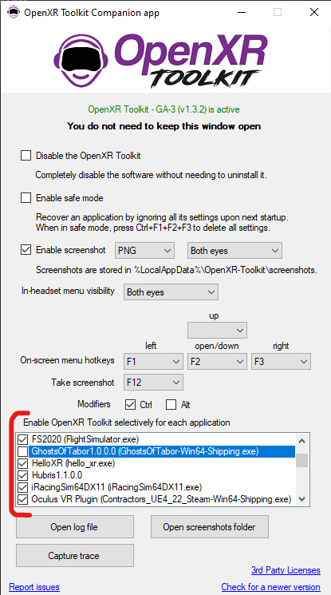

## Table of contents
{: .no_toc .text-delta }

1. TOC
{:toc}

---

## Introduction

### What OpenComposite does

The goal of [OpenComposite](https://gitlab.com/znixian/OpenOVR/-/tree/openxr) is to run applications built on the legacy OpenVR (predecessor of OpenXR), which typically require SteamVR, to use OpenXR instead.

The diagram below show how games developed for OpenXR and OpenVR typically operate. This is before the introduction of OpenComposite.

<br>
*Ecosystem before OpenComposite*

The diagram below show how OpenComposite enables applications built for OpenVR to bypass SteamVR and to take advantage of OpenXR.

<br>
*Ecosystem with OpenComposite*

### Headset compatibility

| Headset brand | Has native OpenXR support? | Can leverage OpenComposite? |
| --- | --- | --- |
| Windows Mixed Reality (HP Reverb, Samsung Odyssey...) | Yes | Yes |
| Oculus | Yes [1] | Yes [1] |
| Varjo | Yes | Yes |
| Pimax | Yes [2] | Yes |
| HTC Tier 1 (Vive original, Vive Pro) | No [3] | No |
| HTC Tier 2 (Vive Cosmos, Vive Focus) | Yes [3] | Yes [4] |
| Valve (Index) | No | No |
| Pico | No | No |

[1] Oculus Quest headsets run either with "Link" (cable or AirLink) and Virtual Desktop. When using Virtual Desktop, you must use SteamVR. OpenComposite currently does not support Virtual Desktop, and therefore OpenComposite can only be used with Link.

[2] Pimax support requires to use the unofficial [PimaxXR](https://github.com/mbucchia/Pimax-OpenXR/wiki) OpenXR runtime.

[3] HTC headsets with outside-in tracking (Lighthouse) only work through SteamVR. HTC headsets with inside-out tracking have native OpenXR support (enabled through the VIVE Console software).

[4] HTC headsets using the native OpenXR runtime can be used with OpenComposite but not with OpenXR Toolkit.

### How is it different from OpenXR Toolkit?

OpenComposite is a separate software from OpenXR Toolkit, developed and maintained by a different team.

The goal of OpenXR Toolkit is to add functionality to OpenXR applications. However, not all applications are written for OpenXR, and therefore OpenXR Toolkit cannot be used with these applications, unless they can use OpenComposite to use OpenXR.

OpenXR Toolkit is not necessary in order to take advantage of OpenComposite to bypass SteamVR. OpenXR Toolkit can be _optionally_ installed to add additional tweaks and performance-improvement features to the games using OpenXR directly or OpenComposite.

<br>
*OpenXR Toolkit with OpenComposite*

For more details on OpenVR, OpenXR, OpenComposite, you may read [An Overview of VR Software Components](https://fredemmott.com/blog/2022/05/29/vr-software-components.html).

## Game compatibility

Both OpenComposite and OpenXR Tookit are limited in the applications that they support. Sometimes, combinations of OpenComposite plus OpenXR Toolkit are also not working. The table below tracks known games to work with OpenComposite and whether they also work with OpenXR Toolkit.

**Do not use any version of OpenXR Toolkit older than 1.1.4 with OpenComposite.** Older versions are not compatible.

There is an [official compatibility for OpenComposite](https://docs.google.com/spreadsheets/d/1s2SSuRt0oHm91RUZB-R-ef5BrfOtvP_jwDwb6FuMF9Q/edit#gid=2068512515), and you can also refer to the table below for compatibility with OpenXR Toolkit.

| Game | OpenComposite | OpenXR Toolkit |
| --- | --- | --- |
| American Truck Simulator 2 | Yes | Yes |
| Assetto Corsa | Yes | Yes |
| Assetto Corsa Competizione | Yes | Yes [1] |
| Automobilista 2 | Yes | Yes |
| Digital Combat Simulator | Yes | Yes |
| Dirt Rally 2 | Yes [2] | Yes [2] |
| Elite Dangerous | Yes | Yes |
| Euro Truck Simulator 2 | Yes | Yes |
| IL-2 Sturmovik | Yes | Yes [3] |
| iRacing | Yes | No [4] |
| F1 2022 | Yes | Yes |
| Pavlov VR | Yes | Yes |
| Project Cars 2 | Yes | Yes |
| Project Cars 3 | Yes | Yes |
| rFactor 2 | Yes | Yes |
| Subnautica | Yes | Yes |
| X-Plane 11 | Yes [5] | No |
| X-Plane 12 | Yes [5] | No |

[1] Supports Eye-tracked Foveated Rendering.

[2] Dirt Rally 2 with the eye accomodation fix requires [dr2vrfix-openxr](https://github.com/mbucchia/dr2vrfix-openxr).

[3] Does not support Fixed Foveated Rendering.

[4] iRacing now has official support for OpenXR, and OpenXR Toolkit is only compatible in that mode, and not with OpenComposite.

[5] On Windows Mixed Reality, X-Plane requires the use of [OpenXR-Vk-D3D12](https://github.com/mbucchia/OpenXR-Vk-D3D12).

Do you have a game working but it's not in the list? Please file an [Issue](https://github.com/mbucchia/OpenXR-Toolkit/issues) to let us know!

### Third party software compatibility

A lot of mods don't play well together. This includes ReShade, vrperfkit, openvr_fsr...

Before installing OpenComposite, be sure to disable them. You may run a repair of the game from Steam to do that and restore your original game DLLs.

## Step-by-step

1) Make sure OpenXR is properly configured on your system.

<details>
  <summary>How to do it on Windows Mixed Reality...</summary>
  <p>Use either one of the methods below.</p>
  <p>From the <i>Mixed Reality Portal</i>:</p>
  
  <p>From the <i>OpenXR Tools for Windows Mixed Reality</i>:</p>
  
</details>

<details>
  <summary>How to do it on Oculus...</summary>
  <p>Use either one of the methods below.</p>
  
  
</details>

<details>
  <summary>How to do it on Varjo...</summary>
  <p>From the <i>Varjo Base</i>:</p>
  
</details>

<details>
  <summary>How to do it on Pimax...</summary>
  <p>You must download <a href="https://github.com/mbucchia/Pimax-OpenXR/wiki">PimaxXR</a>.</p>
  <p>From the <i>PimaxXR Control Center</i>:</p>
  
</details>

2) Download the [OpenComposite Launcher](https://znix.xyz/OpenComposite/runtimeswitcher.php?branch=openxr) and extract it to the installation locatio of your choice.

3) Turn OpenComposite on.

Open the `OpenComposite.exe` application:


Click "Switch to OpenComposite":


## Tips for using OpenComposite

### Understand the difference between Steam and SteamVR

When using OpenComposite, you will bypass the SteamVR platform that enables your VR content to run. But you will still need to use Steam, the application store. Just because you will start a game from Steam doesn't mean that it will use SteamVR (unless OpenComposite is not correctly set up for this game).

### OpenComposite "pretends" to be SteamVR

OpenComposite replaces the SteamVR implementation of the OpenVR library. Therefore, OpenComposite replaces and pretends to be SteamVR. When starting an application, choose to use SteamVR! OpenComposite will intercept the intent to use SteamVR, and will redirect the application to OpenXR instead.


### Be sure to grab the OpenXR version of OpenComposite

OpenComposite was originally developed for Oculus. When looking up OpenComposite, you may end up on the GitLab page for the project, which defaults to the "main" branch, which is for Oculus only. Be sure to pick the "openxr" branch.

As shown in the link below, the URL ends with `/tree/openxr`.

[https://gitlab.com/znixian/OpenOVR/-/tree/openxr](https://gitlab.com/znixian/OpenOVR/-/tree/openxr)

To confirm that you landed on the right place, you may look for "openxr" in the list box on the left, as shown below.


If you mistakenly pick the incorrect version, you will get the following error at start up, referring to "LibOVR":


### Don't use the legacy OpenComposite-ACC, aka v0.6.3

Before being officially included in the OpenComposite project, support for OpenXR was implemented in a separate project by developer Jabbah. The name of the project was OpenComposite-ACC.

This project is now defunct and superseded by the official OpenComposite. If you get an error message containing the path to a file in a user "Jabbah" folder, then you are using the deprecated version, and you must immediately switch to the newer, [official OpenComposite](https://gitlab.com/znixian/OpenOVR/-/tree/openxr).


### Don't install/use the Windows Mixed Reality (WMR) Portal and/or Tools if you don't have a WMR device

Many tutorials out there focus on setting up OpenComposite for Windows Mixed Reality (WMR). This is a specific category of headsets, like HP Reverb brand.

If your headset is of Oculus, Varjo, or Pimax branch, don't bother with the WMR stuff!

### Don't set up everything at once!

Before even considering the use of OpenXR Toolkit, test the application with just OpenComposite. If the application does not work with OpenComposite only, there is no point in adding OpenXR Toolkit in the mix. You must first get the application to work with OpenComposite, then try to enable OpenXR Toolkit.

You may use the  _OpenXR Toolkit Companion app_ (found on the desktop or Start menu) to disable the OpenXR Toolkit system-wide (1st checkbox near the top) or just for that application. **Note that an application will only show up in the list after it is run at least once.**



If you have other OpenXR API layers ("mods"), you should also try disabling them one at a time. Open the registry and navigate to `HKEY_LOCAL_MACHINE\Software\Khronos\OpenXR\1\ApiLayers\Implicit`. You will see a list of files, corresponding to all the OpenXR API layers installed:


You may disable an API layer by changing its value from 0 (enabled) to 1 (disabled). You can re-enable it later by reverting that change.

### Disable OpenComposite for incompatible applications

If an application does not work with OpenComposite, you can disable OpenComposite through the _OpenComposite Launcher_ by clicking "Switch to SteamVR":


### The game will not start with error -35

If your headset is not properly connected, powered on, or detected you will get the following error:


Make sure to connect and power on your headset prior to starting your game.

If the issue persist, it is likely that you have not correctly set up your OpenXR runtime, and it is looking for the wrong headset (and cannot find it!). Read the next section about error -13 right below.

### The game will not start with error -13

If no OpenXR runtime is currently set, you will get the following error:


Follow the [step-by-step guide](#step-by-step) further above to properly set up your OpenXR runtime.

If your OpenXR runtime is properly set, a registry key named `ActiveRuntime` will be created under `HKEY_LOCAL_MACHINE\Software\Khronos\OpenXR\1`.


### The game will not start with error -32

If you get the following error:


You are likely missing some system DLL files. The most common missing DLL is the [Visual C++ Redistributables](https://aka.ms/vs/17/release/vc_redist.x64.exe).

### The game will not start with error "unknown config option"

Don't use a stale `opencomposite.ini` configuration file (from an older version of OpenComposite for example).


There are several tutorials online referencing the older OpenComposite-ACC project (see above), which supported different options than the newer OpenComposite. If you are getting errors mentioning unknown config options, try deleting the `opencomposite.ini` file in the application folder.

### The image and/or OpenXR Toolkit menu is upside down

This can happen with certain buggy versions of OpenXR Toolkit or certain OpenXR runtimes.

Create an `opencomposite.ini` file in the folder of the game, and add the following line to it:

```
invertUsingShaders=true
```

Make sure that the file extension is `.ini` and not `.ini.txt`!

### If all else fails...

Head to the [OpenComposite Discord](https://discord.gg/sQ2jwSb62J) for support. Before posting, be sure to gather the OpenComposite log file from `%LocalAppData%\OpenComposite\logs` (just copy/paste this path into your Start menu or file explorer):


When posting a message for support, always include the following information:

- What game/application you are trying to use.
- What headset you are using.
- **Always provide the log file**.
- Be very clear when you describe your issue.

### More OpenXR Toolkit troubleshooting

See [Troubleshooting](troubleshooting) for more details about OpenXR Toolkit troubleshooting.
