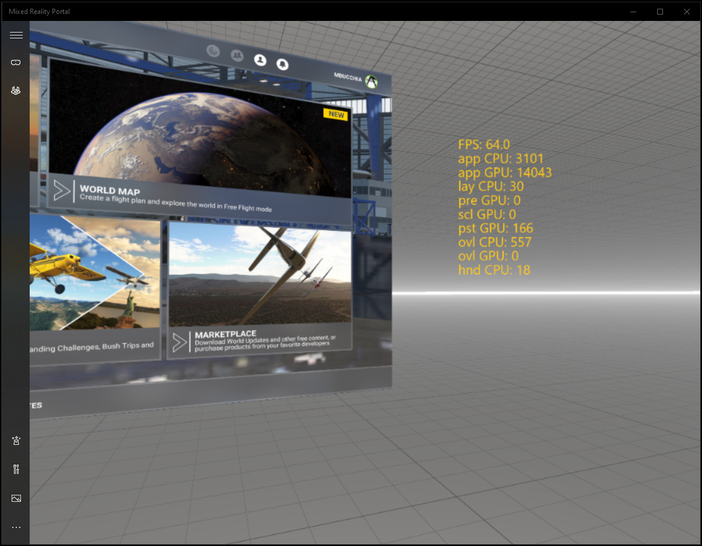

## Table of contents
{: .no_toc .text-delta }

1. TOC
{:toc}

---

## Enabling the overlay

In order to enable the detailed overlay, you must check the _Enable experimental settings_ box in the _OpenXR Toolkit Companion app_. The detailed overlay will then be unlocked from the in-headset menu.

 
*The detailed overlay*

## Advanced metrics

* **app CPU**: The time spent (on CPU) by the application to produce a frame. This may include game logic. This value is not always measurable (and may not be displayed).
* **rdr CPU**: The time spent (on GPU) by the application for the rendering part a frame. This may not include game logic.
* **app GPU**: The time spent (on GPU) by the application to produce a frame. **Note than if the application is CPU-bound, this value may be incorrect or inaccurate**.

## Developer metrics

_Note_: All durations are in microseconds.

* **lay CPU**: The overhead (on CPU) of the OpenXR Toolkit.
* **scl GPU**: The time spent (on GPU) to do upscaling by the OpenXR Toolkit.
* **pst GPU**: The time spent (on GPU) in the post-processing by the OpenXR Toolkit.
* **ovl CPU**: The time spent (on CPU) to draw the OpenXR Toolkit menu/overlays.
* **ovl GPU**: The time spent (on GPU) to draw the OpenXR Toolkit menu/overlays.

_Intended for developers_:

* **Color/Depth L/R**: Whether the color buffer (C) and depth buffer (D) were identified for each eye.
* **heur**: The type of heuristic in use for detecting left/right eye render passes (for Foveated Rendering).
* **biased**: The number of Pixel Shader samplers that were biased.
* **VRS RTV**: The number of render passes that were used with VRS (for Foveated Rendering).
