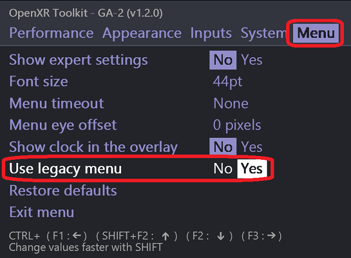
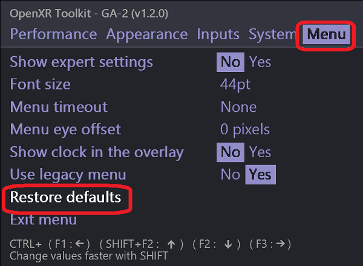
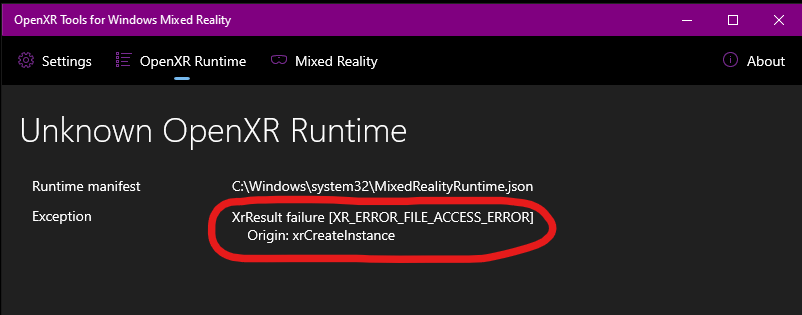
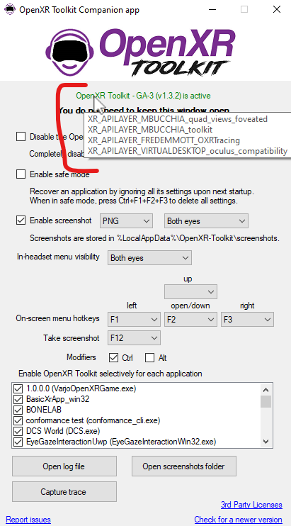
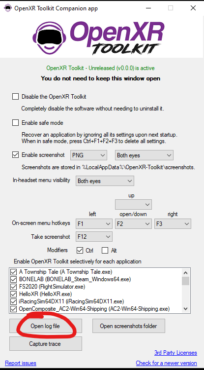

## Table of contents
{: .no_toc .text-delta }

1. TOC
{:toc}

---

## Always make sure you are running the latest version

Before starting troubleshooting, always make sure you are running the latest version of the following:

- Latest version of your OpenXR runtime. This is typically updated or installed via the Windows store (for Windows Mixed Reality) or the vendor's software (for Oculus, Varjo). Sometimes, you will need to manually check the vendor's website (for Pimax unofficial runtime for example).

- Latest version of OpenXR Toolkit, downloadable from the front page of this website.

- Latest version of your graphics drivers.

**Half of the "something does not work for me" issues are resolved by updating to the latest software.**

## Menu is not showing

There are a few common situations leading to this issue.

### Make sure your application uses OpenXR

**OpenXR Toolkit only works with OpenXR applications**. Not all applications are built for OpenXR. See the [index#supported-applications](Compatibility list) for a list of applications known to work.

After running your application for the first time, open the _OpenXR Toolkit Companion app_, and inspect the list of applications:

<br>
*The list of recognized applications*

If your application does not show up here: your application is not built using OpenXR. **The OpenXR Toolkit will not work.**

### Try the legacy menu mode

Certain versions of the OpenXR runtime have issues with 2D overlays like the OpenXR Toolkit menu. Try switching to "legacy mode". Enable Safe mode before starting the application:

<br>
*Enabling safe mode*

Hopefully, the menu will now be displayed. Navigate to the _Menu_ tab, then toggle _Use legacy mode_ to _On_:

<br>
*Enabling legacy menu*

You can now disable Safe mode and start your application normally.

### Make sure your keyboard works correctly

This has been reported due to certain keyboards requiring special key presses to use the Function keys (such as Fn+F1 for example). This can also be due to 3rd party software intercepting the Function keys.

Use the [Keyboard tester](https://www.keyboardtester.com/tester.html) to check if your key combinations work.

Please use the _OpenXR Toolkit Companion app_ to try different hotkeys, selecting keys other than the Function keys.

## Reset all the settings

While an application is running, you may at any point reset all the settings to their default values by pressing simultaneously the keys bound to all 3 of the menu actions. If no custom key combinations have been set in the _OpenXR Toolkit Companion app_, this combination is Ctrl+F1+F2+F3. **Spam all 4 keys until you see the Welcome prompt display.**

You can also navigate to the _Menu_ tab and choose _Restore defaults_:

<br>
*Restoring default settings*

## Disable ReShade

If you had previously installed ReShade or any similar mod for your application, please disable or delete it in order to use the OpenXR Toolkit.

## Missing Visual C++ system component

If the OpenXR Toolkit makes your application refuse to start, try installing the [Visual C++ Redistributables](https://aka.ms/vs/17/release/vc_redist.x64.exe).

This issue will manifest itself with the `XR_ERROR_FILE_ACCESS_ERROR` when using Windows Mixed Reality or inspecting log files.

<br>
*Errors you will see when missing Visual C++ Redistributables*

## Start in Safe mode

If an application fails to start due to some settings changes, you may use the  _OpenXR Toolkit Companion app_ (found on the desktop or Start menu) to _Enable safe mode_. In this mode, the settings for this application will not be loaded.

<br>
*Enabling safe mode*

You may then either:

- [Reset all the settings](#reset-all-the-settings).

- Change your settings to avoid the problem. Note that in safe mode, settings are not loaded, but the modified settings are still stored. You may need to toggle a setting on/off a few times to make sure the new value is saved before exiting Safe mode.

## Disable other OpenXR API layers

Hover on top of the "OpenXR Toolkit is active" label in the _OpenXR Toolkit Companion app_ to see a list of other OpenXR API layers.

<br>
*The list of other OpenXR API layers in use on your system*

Try disabling or uninstalling them and see if the problem is resolved.

## Inspect the log file

In order to inspect the log file to try to understand issues with the toolkit, you may open the _OpenXR Toolkit Companion app_ (found on the desktop or Start menu) and click the _Open log file_ button. This will open the file located at `%LocalAppData%\OpenXR-Toolkit\logs`.

<br>
*Accessing the log file*

Please note that certain applications may run in a security-sandbox environment. In this case, the log file may be located under the corresponding application subfolder in `%LocalAppData%\Packages`. You may search for a file named `XR_APILAYER_MBUCCHIA_toolkit.log` if unsure of the exact location.

<br>
*An example log file*

## Missing DirectX legacy runtime

Check for the following error in the log file:

```
[OXRTK] 2022-02-28 20:41:32 -0600: HRESULT failure [80004005]
Origin: m_fontWrapperFactory->CreateFontWrapper(get(m_device), m_fontFamily.c_str(), set(m_fontNormal))
```

To solve this problem, please install the [DirectX legacy runtime package](https://www.microsoft.com/en-us/download/details.aspx?id=35).

## Disabling the OpenXR Toolkit with incompatible applications

You might reach a point where you determine that an application is not compatible with the OpenXR Toolkit. You may use the  _OpenXR Toolkit Companion app_ (found on the desktop or Start menu) to disable the OpenXR Toolkit just for that application.

<br>
*Per-application control*

## Checking if you are CPU or GPU limited

**Perform the test below with any form of motion reprojection or asynchronous space warp (ASW) disabled and any frame limiting/throttling feature disabled (eg: in your driver or NVIDIA control panel).**

Use the _Detailed_ overlay (see [Overlay](overlay)) to inspect your application CPU and GPU times (respectively **app CPU** and **app GPU**). 

When the value of **app GPU** is greater than the value of **app CPU**, you are limited by your GPU, and you may use features such as [Upscaling](upscaling) or [Foveated Rendering](fr) to relieve your GPU. If you are not GPU limited, then these features will not help to gain performnce. Instead, you may alter other settings of your application, such as details settings, and increase them until you become GPU limited, and can enable the performance-enhancing features previously mentioned.
